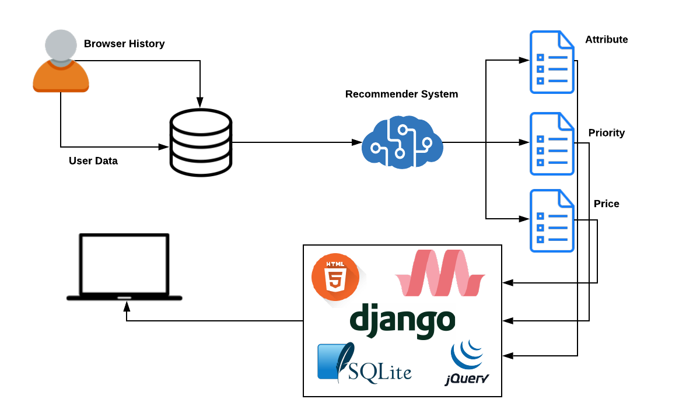

## Team 13 - Service - Support Recommendation

### Project Overview
----------------------------------

Problem Statement
* Create a model to recommend support and services to the user.

Proposed Solution
* Analyze user's browser history and user data to find user's problems and recommend solution(services)

### Solution Description
----------------------------------

* Analyze user's browser history and user data to find user's problems and recommend solution(services)

#### Architecture Diagram

Affix an image of the flow diagram/architecture diagram of the solution

#### Technical Description

An overview of 
* What technologies/versions were used
* Setup/Installations required to run the solution
* Instructions to run the submitted code

### Team Members
----------------------------------

List of team member names and email IDs with their contributions

* Hrithik Bandaru   --  hrithik170508@mechyd.ac.in    -- Background Research, User data, Front End and modelled Recommender System.

* Kiran NVS         --  saikiran170562@mechyd.ac.in   -- Created backend with database integration and recommender system.

* Kritvi Mittal     --  kritvi1170520@mechyd.ac.in    -- Data Collection for modelling, Front End and database management.
